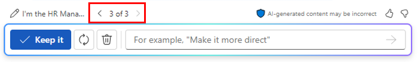

# Word の Copilot を使用して職務記述書を作成する
---
Copilot in Word は、AI を活用した文章作成アシスタントで、人事担当者が作業プロセスを合理化し、生産性を向上させるのに役立ちます。 Copilot は、自動化された履歴書のスクリーニング、職務説明の支援、効率的なオンボード、従業員のフィードバック分析など、さまざまな方法で人事担当者を支援できます。

たとえば、Copilot は、履歴書のスクリーニング プロセスの初期段階を自動化し、人事担当者が大規模な応募者プールから最も適した候補者をすばやく特定するのに役立ちます。 また、Copilot は、契約の生成からポリシーの配布に至るまでのオンボード ドキュメントの処理を簡素化し、オンボード プロセスをより効率的なものにすることができます。 さらに、初日から歓迎されていると感じ、十分な情報を得られるように、新規採用者向けにカスタマイズしたオンボード計画を作成できます。

Copilot in Word は、従業員のフィードバックやアンケートを分析して、従業員の満足度と改善領域に関する分析情報を人事担当者に提供することもできます。 従業員向けの調整されたトレーニングと能力開発プログラムを提案し、スキルとキャリアの向上を支援します。

### 演習

あなたは Graphic Design Institute の人事マネージャーとして、新しいシニア アニメーション デザイナーの採用プロセスを開始しました。 あなたのスタッフは、この役割のすべての職務責任の概要を記載したドキュメントを作成しました。 次に、Copilot in Word を使用して、このドキュメント内の役割の責任に基づいた職務説明を作成する必要があります。

1.  次のリンクを選択して [Graphic Design Institute - Design Team Responsibilities](https://go.microsoft.com/fwlink/?linkid=2268824) ドキュメントをダウンロードします。
2.  ダウンロードが完了したら、ファイルを OneDrive アカウントに移動し、ファイルを開いてから閉じて、最近使用した (MRU) ファイルの一覧に表示されるようにします。
3.  Microsoft Edge ブラウザーで Microsoft 365 タブを開いている場合は、ここでそれを選択します。それ以外の場合は、新しいタブを開き、次の URL を入力します: **https://www.office.com**
4.  **Microsoft 365** で **Microsoft Word** を開き、白紙の文書を開きます。
5.  **[Copilot を使って下書き]** ウィンドウに次のプロンプトを入力します。ただし、次の手順でファイルをプロンプトにリンクするまでは、**[生成]** ボタンを選択しないでください。
    
    **私は Graphic Design Institute の人事マネージャーです。新しいシニア アニメーション デザイナーの採用プロセスを開始したところです。この役割についての職務責任の概要を示した添付ドキュメントを確認し、それらの責任に基づいた職務説明を作成してください**。
6.  ここで、ダウンロードした **Graphic Design Institute - Design Team Responsibilities.docx** ファイルをプロンプトに添付する必要があります。 **[Copilot を使って下書き]** ウィンドウで、**[コンテンツを参照する]** ボタンを選びます。 表示されるドロップダウン メニューで、**Graphic Design Institute - Design Team Responsibilities.docx** ファイルがファイルの一覧に表示されている場合は、それを選択します。 表示されていない場合は、**[クラウドからファイルを参照]** を選択し、**[最近使用したファイル]** の一覧からファイルを選択し、**[添付]** ボタンを選択します。 ファイルが **[最近使用したファイル]** の一覧に表示されない場合は、**[ファイルを選択]** ウィンドウのナビゲーション ウィンドウの上部にある **[マイ ファイル]** を選択し、ファイルを保存したフォルダーに移動し、ファイルを選択し、**[添付]** を選択します。 プロンプトにファイルがどのように表示されるかに注目してください。
7.  **生成**を選択します。
8.  職務説明ドキュメントの最初の下書きを確認します。 職務責任のドキュメントに記載されている詳細の多くが含まれていないことがわかります。 代わりに、各責任について要約された文が 1 つか 2 つ示されています。 この不足を修正するために、次のプロンプトを入力し、右向きの矢印を選択します。
    
    **この職務説明の下書きはスタートとして悪くありませんが、職務責任のドキュメントに記載された詳細のほとんどが含まれていませんでした。もう一度やり直してください。今回は、各責任領域の概要を説明し、シニア アニメーション デザイナーに求められる責任を選択してください**。
9.  2 番目の下書きを確認します。 今回も、あなたには Copilot がもっと詳細を提供する必要があると感じられます。 次のプロンプトを入力して、より具体的にできるかどうかを確認します。
    
    **この職務説明の下書きは改善されていますが、私が求めている詳細がまだ不足しています。職務責任のドキュメントには、各領域の詳細な責任が記載されています。それらの詳細をこの職務説明に含めます。できるだけ具体的にしてください**。
10. 結果を確認すると、"何を望むかに気を付けなさい" という格言が思い出されます。 この 3 番目の下書きでは、責任のリストが長くなっています。実際のところ、実用的な職務説明ドキュメントとしては長すぎるかもしれません。 この時点で、前の下書きを見直して、この長い下書きよりも前の下書きの方が望ましいかどうかを確認します。 プロンプト フィールドのすぐ上にある [Copilot] ウィンドウで、ドキュメントの現在のバージョンの下書きに注目します。 この場合、表示されている下書きは 3/3 です。 これより前の下書きを確認するには、左向きの矢印 (&lt;) を選択して 2 番目の下書きに戻り、次に最初の下書きに戻ります。 右向きの矢印 (&gt;) を使用して最新の下書きに戻ります。
    
    
    
    
    この場合は、2 番目の下書きに戻ります。 責任のリストをもう一度確認します。 これは 3 番目の下書き内のリストほど広範囲ではありませんが、見た目はすっきりしており、このシニア アニメーション デザイナーの役割で何が期待されているかを求職者が理解するのに十分な情報を提供します。 2 番目の下書きが最後の下書きよりも望ましいと判断し、この下書きを使用することを選択します。 [Copilot] ウィンドウで、**[保持する]** ボタンを選択します。
11. この職務説明ドキュメントを使用して先に進む準備ができたので、**Graphic Design Institute - Job descriptions.docx** というファイル名で OneDrive アカウントに保存します。

    > **注:** 次の演習で使用するため、このドキュメントを保存することが重要です。
